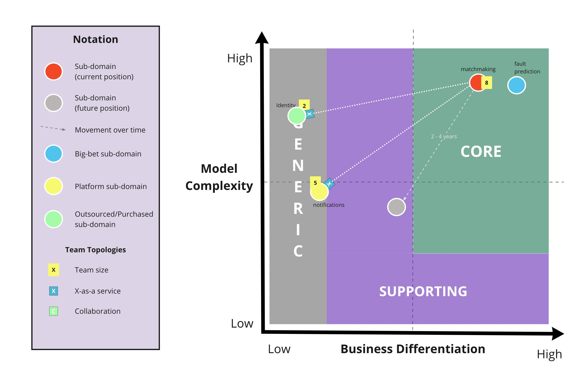
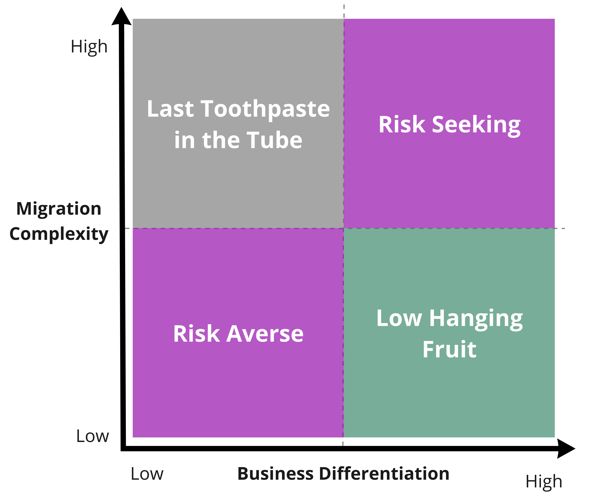

# Core Domain Charts

Core Domain Charts help you to visualise the strategic importance of each sub-domain or business capability in your software architecture allowing you to make business model-aligned architectural decisions.

[Core Domains](https://www.youtube.com/watch?v=PBRluTD5oHo) are the parts of your domain where the expected [ROI](https://www.investopedia.com/terms/r/returnoninvestment.asp) is greatest, and deserve the highest focus.

The true power of this technique is the conversations that it triggers, especially cross-discipline. Complexity is something that engineers can gauge whereas business differentiation is provided by product managers or business stakeholders.

## How to Use
There are a variety of ways the Core Domain Chart can be used, but it's important not to try to and visualise all the possible information in a single diagram. Below are multiple versions showing different types of information to choose from.

### Sub-domain/Bounded Context Portfolio
This is the simplest flavour. Simply plot each of your sub-domains or bounded contexts on the chart to get a relative sense of ordering between them.

### Context Map With Team Topologies
You can augment your Core Domain Charts with the dependencies between your bounded contexts and the type of [Team Topologies](https://github.com/TeamTopologies) Interaction Mode in play.

### Architecture Migration
With a slight tweak of the y-axis label, core domain charts can be used to plan the order in which you migrate from your current architecture to your target architecture.

## Examples

Check out the [Examples](/examples). Please feel free to create a pull request with your own suggestions.

## Additional Resources

- [Core Domain Patterns](https://medium.com/nick-tune-tech-strategy-blog/core-domain-patterns-941f89446af5)

- [Visualising Sociotechnical Architecture with DDD and Team Topologies](https://medium.com/nick-tune-tech-strategy-blog/visualising-sociotechnical-architecture-with-ddd-and-team-topologies-48c6be036c40)

## Contributors

Thanks to all [existing and future contributors](https://github.com/ddd-crew/core-domain-charts/graphs/contributors) and to [Eduardo da Silva](https://twitter.com/emgsilva) who has contributed to the Core Domain Chart:

The Core Domain Chart was inspired heavily by:

- [Wardley Mapping](https://medium.com/wardleymaps)
- [Team Topologies](https://teamtopologies.com/)

## Contributions, Questions and Feedback

The Core Domain Chart is freely available for you to use. In addition, your feedback and ideas are welcome to improve it or to create new versions.

If you have questions you can ping us or open an [Issue](https://github.com/ddd-crew/core-domain-charts/issues/new/choose).

Feel free to also send us a pull request with your examples.

[![CC BY 4.0][cc-by-shield]][cc-by]

This work is licensed under a [Creative Commons Attribution 4.0 International
License][cc-by].

[![CC BY 4.0][cc-by-image]][cc-by]

[cc-by]: http://creativecommons.org/licenses/by/4.0/
[cc-by-image]: https://i.creativecommons.org/l/by/4.0/88x31.png
[cc-by-shield]: https://img.shields.io/badge/License-CC%20BY%204.0-lightgrey.svg
